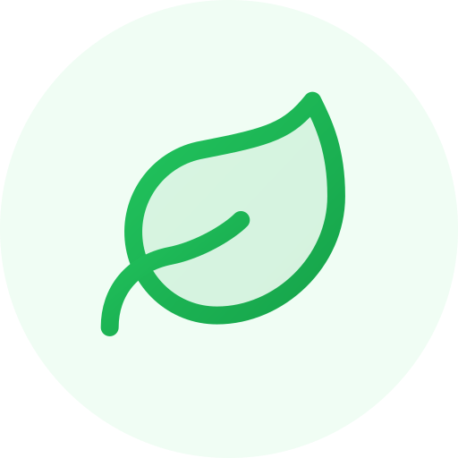
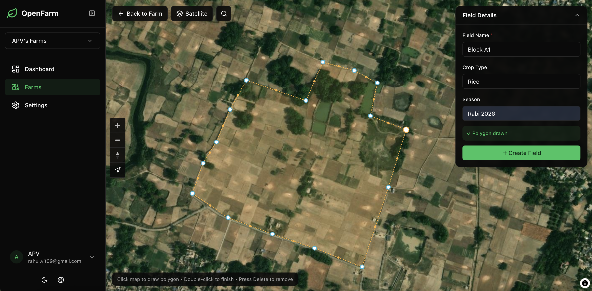
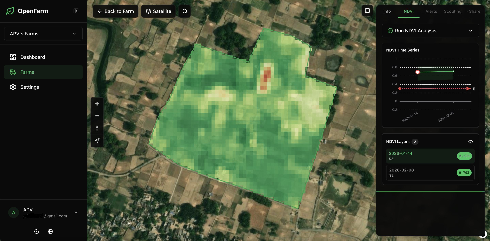

<div align="center">

# OpenFarm



### Open Intelligence for Every Farm

Open source self-hostable and reproducible Crop Intelligence Platform

[](https://github.com/superzero11/OpenFarm/actions/workflows/ci.yml)
[](LICENSE)


[](https://github.com/superzero11/OpenFarm)
[](https://discord.gg/spPhvA2u)
[](https://www.patreon.com/c/SuperZero11)

[Report Bug](https://github.com/superzero11/OpenFarm/issues) · [Request Feature](https://github.com/superzero11/OpenFarm/issues)

<p>
  
  
</p>
<p>
  
  
</p>

</div>

**OpenFarm is an open, modular field intelligence platform that fuses satellite, weather, soil, and time to explain what is happening in a field — and why.**

- **Vision:** A world where every farm, from smallholders to enterprises, can access transparent, trustworthy, and affordable digital farming intelligence.
- **Mission:** Build and maintain an open, reproducible crop intelligence platform that turns satellite, weather, soil, and field data into actionable insights — deployable anywhere (self-hosted or hosted).

## Why OpenFarm
- Self-hostable stack with clear service boundaries (Next.js ↔ FastAPI ↔ TiTiler ↔ MinIO ↔ PostGIS)
- Multi-index vegetation monitoring — NDVI, EVI, SAVI (configurable L factor), and NDWI from Sentinel-2 imagery with automatic 24-month historical backfill
- ML-powered automatic field boundary detection (FTW model) with interactive review workflow
- Daily weather data with agricultural indices (GDD, water balance, drought index) via Open-Meteo
- Soil intelligence — automatic soil profile ingestion from SoilGrids (global, 250m) and POLARIS (US, 30m) with texture, pH, carbon, risk scoring, and interactive depth visualization
- Reproducible pipeline with provenance (Element84 STAC → COG → TiTiler tiles)
- Tenant isolation via `X-Org-Id` + JWT; RBAC (`owner`/`admin`/`member`/`viewer`)
- MapLibre + PMTiles (no Mapbox token needed), ECharts for time series
- Open, permissive BSD-3-Clause license

## Prerequisites
- Docker + Docker Compose v2
- Node.js 20+ and npm 10+ (for local web development)
- Python 3.11+ and pip (for local API development)
- Google OAuth credentials (`GOOGLE_CLIENT_ID`, `GOOGLE_CLIENT_SECRET`)

## Architecture

OpenFarm follows a 3-layer strategic architecture:

```
┌─────────────────────────────────────────────────────────────────┐
│  Layer C — Delivery Surfaces                   (Distribution)  │
│  Map UI · Reports · API · Webhooks · MCP · Mobile scouting     │
├─────────────────────────────────────────────────────────────────┤
│  Layer B — Intelligence Engine                       (Moat)    │
│  Phenology · Anomaly detection · Stress signals · Yield        │
│  Risk models · Soil-derived insights · Explainability          │
├─────────────────────────────────────────────────────────────────┤
│  Layer A — Observation Infrastructure         (Data Gravity)   │
│  Satellite · Weather · Soil · Field boundaries · Sensors       │
└─────────────────────────────────────────────────────────────────┘
```

- **Layer A** collects, standardizes, and stores raw signals (satellite imagery, weather, soil profiles, field boundaries)
- **Layer B** transforms observations into explainable, agronomically meaningful insights with confidence scores
- **Layer C** delivers intelligence through maps, reports, APIs, and integrations

**Tech stack:**
```
apps/web/       → Next.js 14 + NextAuth (Google OAuth) + Tailwind + shadcn/ui + MapLibre + ECharts
services/api/   → FastAPI + SQLAlchemy 2.0 (async) + Alembic + Celery tasks
services/tiler/ → TiTiler COG tile server (shared JWT auth)
docker-compose.yml → Postgres/PostGIS, Redis, MinIO, API, Celery worker, TiTiler, Web
```

See [docs/architecture.md](docs/architecture.md) for the full strategic architecture document.

## Quick Start (Full Stack via Docker)
```bash
cp .env.example .env
# Fill GOOGLE_CLIENT_ID / GOOGLE_CLIENT_SECRET
# Generate secrets:
#   NEXTAUTH_SECRET:     openssl rand -base64 32
#   OPENFARM_JWT_SECRET: openssl rand -base64 64

docker compose -f docker-compose.yml -f docker-compose.dev.yml up --build
```

Services:
| Service | URL | Purpose |
|---|---|---|
| Web (Next.js) | http://localhost:3000 | Frontend UI |
| API (FastAPI) | http://localhost:8000 | Backend API |
| API Docs | http://localhost:8000/docs | Swagger UI |
| TiTiler | http://localhost:8080 | COG tiles |
| MinIO Console | http://localhost:9001 | Object storage admin |

Health checks:
```bash
curl http://localhost:8000/healthz    # API
curl http://localhost:8080/healthz    # TiTiler
curl http://localhost:3000/api/health # Web
```

## Local Development

### Frontend (apps/web)
```bash
cd apps/web
npm install
npm run dev          # start dev server
npm run lint         # ESLint
npm run type-check   # TypeScript (no emit)
npm run build        # production build
```

### Backend (services/api)
```bash
cd services/api
pip install -e ".[dev]"   # includes ruff
alembic upgrade head
uvicorn app.main:app --reload --port 8000

ruff check .              # lint
ruff format --check .     # format check
```

### Database Migrations
```bash
cd services/api
alembic revision --autogenerate -m "describe change"
alembic upgrade head

```

## Developer Verification Checklist
Run these before opening a PR:

```bash
# Web
cd apps/web
npm run lint
npm run type-check
npm run build

# API
cd ../../services/api
ruff check .
ruff format --check .
```

## API Conventions
- All endpoints prefixed with `/v1`
- Org-scoped endpoints require `X-Org-Id` header and JWT
- Pagination envelope: `{ items, total, limit, offset }`
- Soft delete via `deleted_at` column
- Geometry stored as `MultiPolygon(4326)`; polygons auto-wrapped
- Audit events on key actions (e.g., field_created)

## Feature Overview

### Layer A — Observation
- **Satellite Intelligence**: NDVI, EVI, SAVI (configurable L), NDWI from Sentinel-2 — STAC search → COG → TiTiler tiles → time-series stats, with automatic 24-month historical backfill and weekly auto-compute
- **Weather Intelligence**: daily historical + 7-day forecast via Open-Meteo — temperature, precipitation, ET₀, soil moisture/temperature, VPD, GDD, water balance, drought index
- **Soil Intelligence**: automatic soil profile from SoilGrids (global, 250m) and POLARIS (US, 30m) — texture-by-depth, pH, organic carbon, CEC, bulk density, AWC, risk scoring, data quality indicators
- **Boundary Detection**: ML-powered field boundary detection (FTW model) from Sentinel-2 — draw area, review with confidence scores, accept as fields
- **Farms & Fields**: draw/upload GeoJSON/KML polygons, auto area calculation, soft delete

### Layer B — Intelligence
- **Per-Index Alerts**: configurable threshold and drop-percentage rules, enriched with weather context and soil data
- **Risk Scoring**: acidification, compaction, leaching, and rooting risk from soil properties
- **Multi-Signal Context**: alerts combine vegetation anomalies + weather conditions + soil characteristics

### Layer C — Delivery
- **Interactive Map**: MapLibre + PMTiles (no Mapbox needed), multi-layer toggle, per-index colormaps
- **Time-Series Charts**: ECharts with percentile bands, NDVI + weather overlay, soil depth visualization
- **Scouting**: geotagged observations with photo upload and auto-attached weather snapshot
- **Sharing**: read-only field health reports via share links with multi-index, weather, and soil summary
- **Auth & RBAC**: Google OAuth → JWT bridge, owner/admin/member/viewer roles, audit logging
- **i18n**: English + Spanish, dark/light theme
- **Changelog**: in-app changelog page with version history

## Quality & CI
- GitHub Actions: lint + type-check (`.github/workflows/ci.yml`)
- Frontend: `npm run lint`, `npm run type-check`
- Backend: `ruff check`, `ruff format --check`
- No tests yet — contributions welcome

## Deployment
See [DEPLOYMENT.md](DEPLOYMENT.md) for a step-by-step guide to deploy on a free Oracle Cloud VM (or any VPS) with Docker Compose + Caddy auto-SSL.

## Roadmap
See [ROADMAP.md](ROADMAP.md) for the full development plan — what's done, what's in progress, and where contributors can help most.

## Contributing & Security
- See [CONTRIBUTING.md](CONTRIBUTING.md) for setup, style, and PR process
- See [CODE_OF_CONDUCT.md](CODE_OF_CONDUCT.md) for community standards
- See [SECURITY.md](SECURITY.md) to report vulnerabilities (hello@openfarm.earth)

## License

BSD-3-Clause — see [LICENSE](LICENSE)
